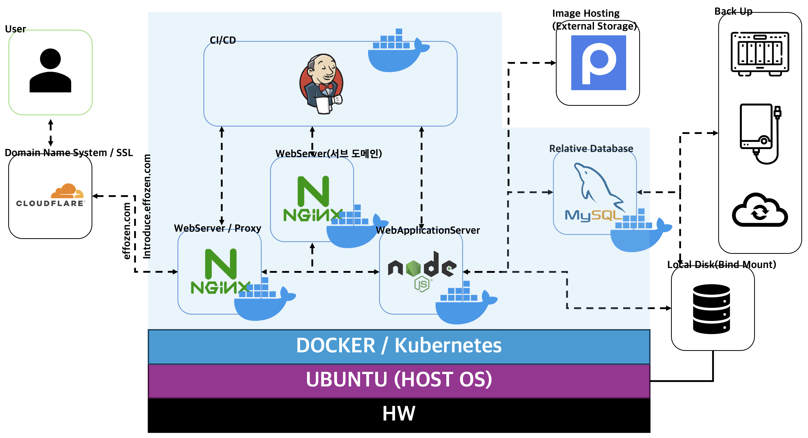
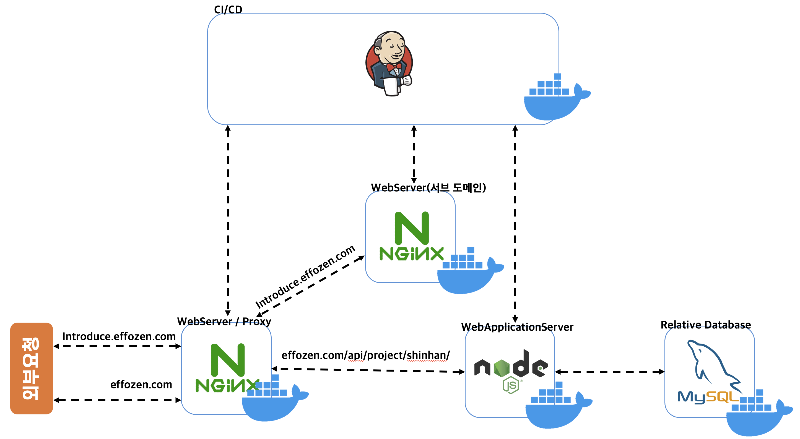
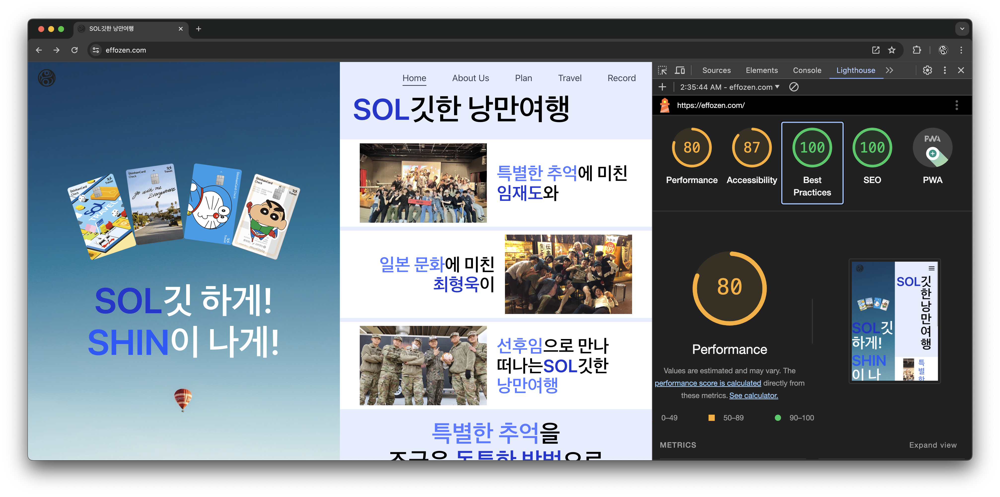
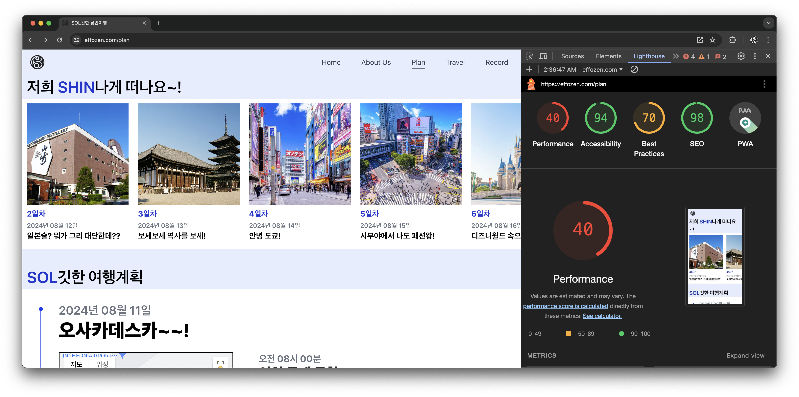
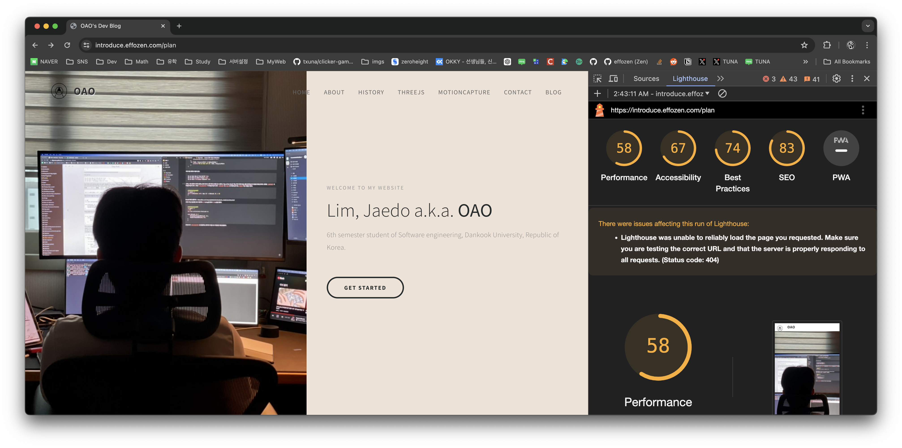
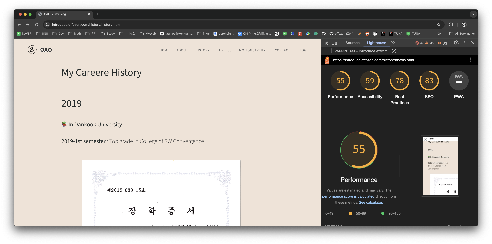
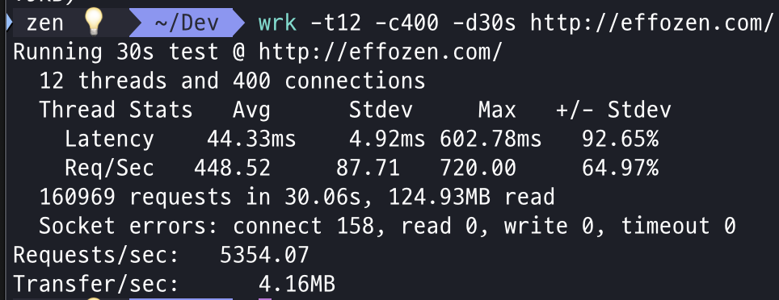
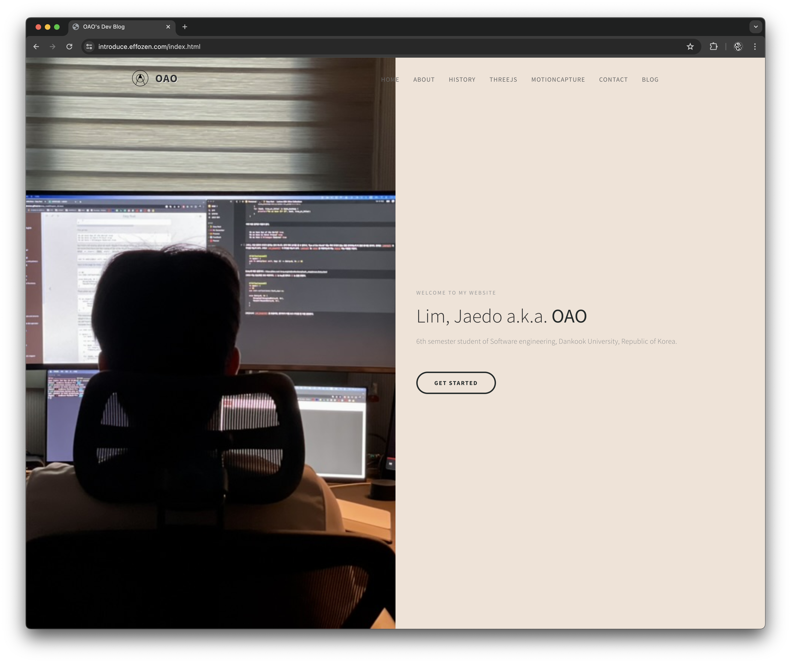
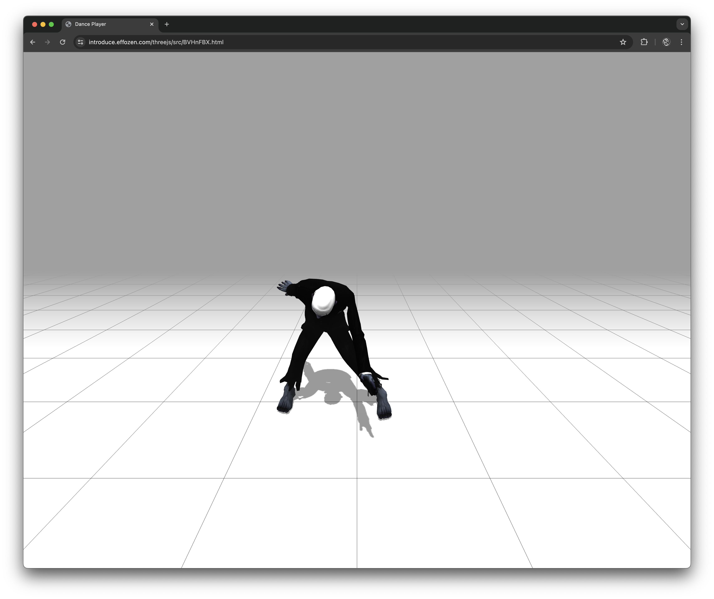

# 💡 2024년 4학년 1학기 클라우드컴퓨팅 과제 💡

## 🚀 개요 🚀


- 서브 도메인을 바탕으로 한 MSA 서비스
- Docker-compose 등의 Docker 기능을 활용하여 배포 일관화

## 🚀 빌드 🚀
```shell
$ cd server
$ docker-compose build
$ docker-compose up -d
```

- 위와 같은 방법으로 빌드할 수 있으며, nginx의 포트는 80번을 사용하기 때문에 80번 포트에 대한 방화벽 처리 / 포트 포워딩이 필요
- jenkins의 경우는 별도로 설정해서, 파일을 이용해야하며, jenkins로 테스트하지 않을 경우에는 client의 내용을 다음과 같은 명령을 이용해서 volume에 복사

```shell
$ cd yarn install
$ cd yarn build
$ cp -r client server/volumes/web 
```

- 위의 방법 이후에 진행
- 정적 페이지의 경우에는 previnfo에 index.html 파일 추가하면 됨

## 🚀 구조 🚀


- NginX(WebServer/Proxy)
  - effozen.com에 대한 요청 처리
  - introduce.effozen.com에 대한 프록시 연결
  - WebApplicationServer에 대한 프록시 연결
- NginX(Webserver)
  - introduce.effozen.com에 대한 요청 처리
- WebApplicationServer
  - effozen.com/api/project/shinhan으로 오는 요청 처리
- Relative Database
  - WebApplicationServer와 직접 소통

## 🚀 테스트 🚀






- 구글 개발자 도구의 lighthouse 이용
- performance(로딩), accessibility(접근성), best practices(웹 표준 준수 여부), SEO(검색엔진 최적화) 성능 평가
- image로딩이 많은 경우에는 성능이 저하되는 요인이 보임 -> 로컬에서 직접 이미지를 보내면 빠르나, 용량 최적화 문제로 image의 경우 postImage에 업로드 후 사용.
  - 이로 인한 로딩 속도에 영향이 있어, 성능 감소가 보임. => 차후 S3 버킷등을 활용해서 개선 예정
- 1,2 번째 이미지는 react를 사용, 3,4 번째는 html을 이용해서 정적 배포.
  - 표준 준수 여부나 접근성 측면에서 감점 요소가 보임
  - 마찬가지로 이미지가 많을 경우, 성능에서 평가가 저하되는 게 두드러짐




- HTTP 성능 벤치마킹 도구인 wrk로 http://effozen.com에 다수에 요청을 보내 테스트
- 테스트는 서버와 동떨어진 맥 PC에서 진행
- 높은 처리율을 보이는 것을 알 수 있음

- 맥 기준 아래의 명령을 통해서 테스트 가능
```shell
// homebrew를 통해서 wrk 다운로드
$ brew install wrk

// 12개의 스레드와 400개의 연결로 30초 동안 테스트 실행
$ wrk -t12 -c400 -d30s http://effozen.com/
```

## 🚀 데모 🚀



